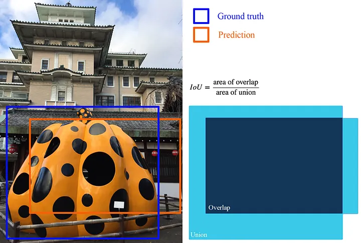

1. Ultralytics Repo: 
https://github.com/ultralytics/ultralytics

Important Variables
- mAP: mean average precision, calculated at IoU (intersection of union) for thresholds from 50% to 95% in 5% increments
- param: number of parameters in millions (M)

IoU Definition: 


Types of Models: 
| Model                                                                                | size<br><sup>(pixels) | mAP<sup>val<br>50-95 | Speed<br><sup>CPU ONNX<br>(ms) | Speed<br><sup>A100 TensorRT<br>(ms) | params<br><sup>(M) | FLOPs<br><sup>(B) |
| ------------------------------------------------------------------------------------ | --------------------- | -------------------- | ------------------------------ | ----------------------------------- | ------------------ | ----------------- |
| [YOLOv8n](https://github.com/ultralytics/assets/releases/download/v0.0.0/yolov8n.pt) | 640                   | 37.3                 | 80.4                           | 0.99                                | 3.2                | 8.7               |
| [YOLOv8s](https://github.com/ultralytics/assets/releases/download/v0.0.0/yolov8s.pt) | 640                   | 44.9                 | 128.4                          | 1.20                                | 11.2               | 28.6              |
| [YOLOv8m](https://github.com/ultralytics/assets/releases/download/v0.0.0/yolov8m.pt) | 640                   | 50.2                 | 234.7                          | 1.83                                | 25.9               | 78.9              |
| [YOLOv8l](https://github.com/ultralytics/assets/releases/download/v0.0.0/yolov8l.pt) | 640                   | 52.9                 | 375.2                          | 2.39                                | 43.7               | 165.2             |
| [YOLOv8x](https://github.com/ultralytics/assets/releases/download/v0.0.0/yolov8x.pt) | 640                   | 53.9                 | 479.1                          | 3.53                                | 68.2               | 257.8             |

2. My Setup 
```bash
GPU: NVIDIA GeForce GTX 1650 Ti 
Windows 10 
```

3. Create environment 
```bash
py -3.11 -m venv env3_11
.\env3_11\Scripts\activate
```

4. Install ultralytics 
```bash
pip install ultralytics
```

5. Camera USB NOTE: When recording, need to use another USB port for the second camera for the script to work! 